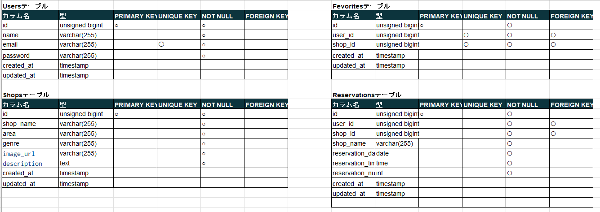

#Advanceターム

#アプリケーション名/Rese
飲食店予約サービス

##作成した目的
ある企業のグループ会社へ独自の飲食店予約サービスを提供するため

##アプリケーションURL
GitHub

##機能一覧
会員登録
ログイン
ログアウト
ユーザー情報取得
ユーザー飲食店お気に入り一覧取得
ユーザー飲食店予約情報取得
飲食店一覧取得
飲食店詳細取得
飲食店お気に入り追加
飲食店お気に入り削除
飲食店予約情報追加
飲食店予約情報削除
エリアで検索する
ジャンルで検索する
店名で検索する

##使用技術

言語フレームワーク｜バージョン
Docker-compose　  ｜3.8
Laravel　         ｜8
PHP　             ｜8.2.10
mysql             |8.0.26

##環境技術

$ cd your_directory
$ git clone 
$ docker-compose up -d
http://localhost:8080でアクセスできるようになります。

##テーブル設計

##ER図

以上、宜しくお願い致します。
